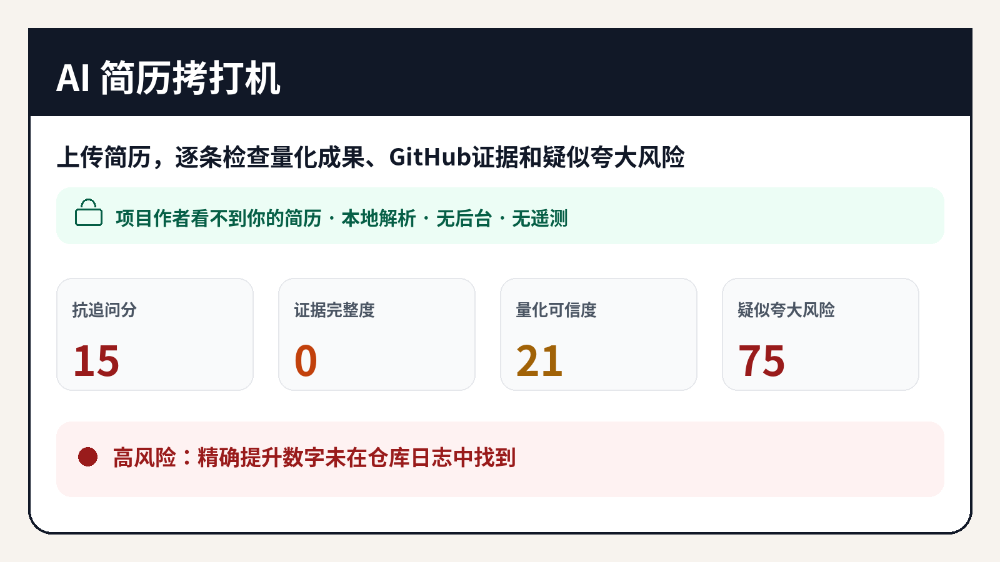

# AI 简历拷打机

上传简历，找出**最容易被面试官问穿的声明**，核对 GitHub 证据，并生成带深色品牌封面、评分卡、风险矩阵和逐条证据审计的中文 PDF 防守报告。

> **隐私：作者看不到你的简历。** 本项目没有作者服务器、账号、数据库或遥测；简历只在你的电脑上处理。使用 Ollama 时，内容不会离开本机。

## Windows 小白使用

1. 点右上角 **Code → Download ZIP**。
2. 解压，双击 **`启动中文版.bat`**。
3. 浏览器里上传简历。

它会检查：精确数字、baseline、原始日志、个人贡献、论文奖项入口，以及简历与 GitHub 代码是否一致。

**高风险不等于造假。** 工具只提示证据缺口，不能替代背景调查。

本地模型推荐 `qwen2.5:7b-instruct`；低配置可用 `llama3.2:3b`。没有模型也可直接使用规则引擎。
